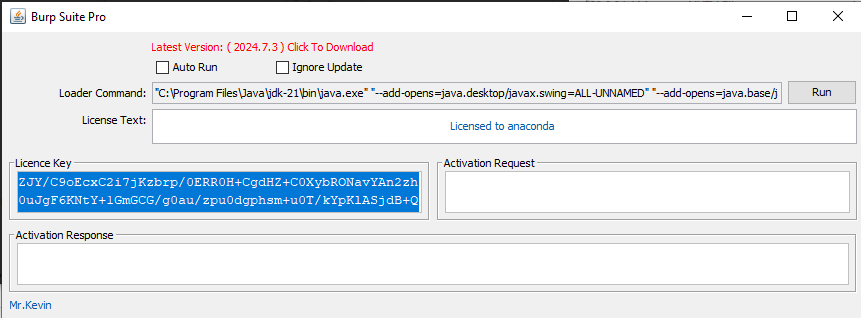
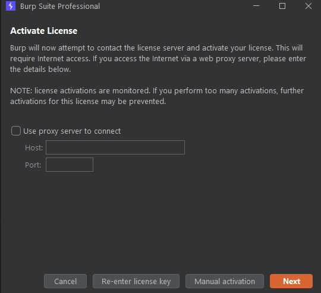
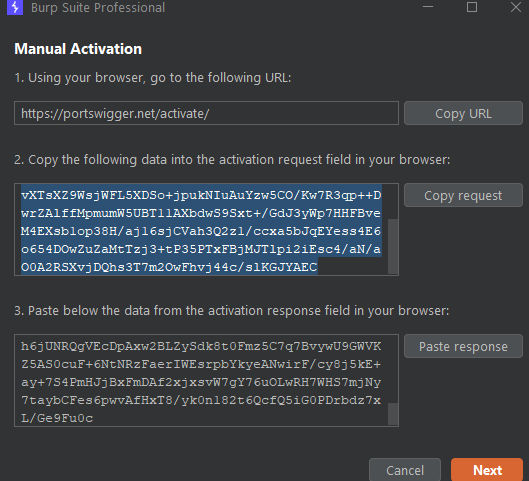
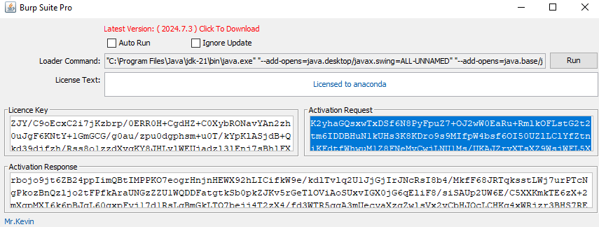
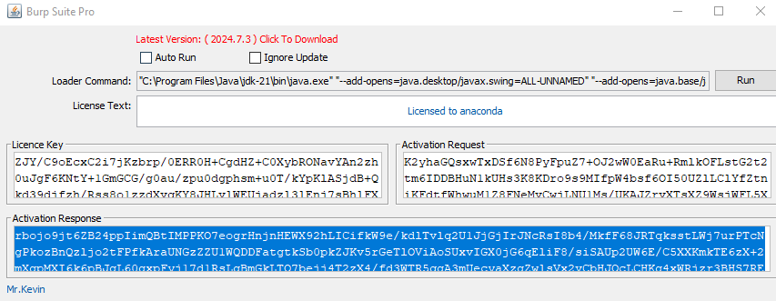
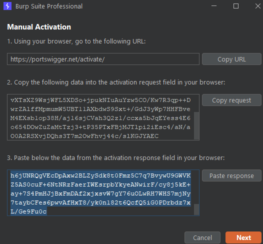
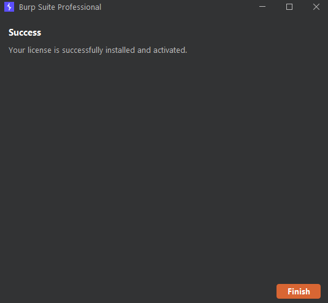
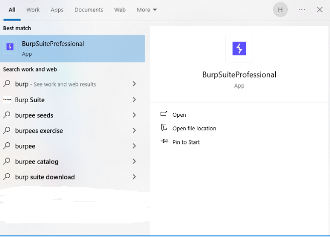

<a id="readme-top"></a>

<br />
<div align="center">
  <a href="https://github.com/nvth/BurpActivator">
    
  </a>

  <h3 align="center">Burpsuite Pro Activator</h3>

  <p align="center">
    Sản phẩm không phải là thuốc, không có tác dụng thay thế thuốc chữa bệnh!
    <br />
    <a href="https://github.com/nvth/BurpActivator?tab=readme-ov-file"><strong>Explore the docs »</strong></a>
    <br />
    <br />
    <a href="https://github.com/nvth/BurpActivator/releases">Release</a>
    ·
    <a href="https://github.com/nvth/BurpActivator/issues/new?labels=bug">Report Bug</a>
    ·
    <a href="https://github.com/nvth/BurpActivator/issues/new?labels=question">Request Feature</a>
  </p>
</div>


<!-- TABLE OF CONTENTS -->
<details>
  <summary>Table of Contents</summary>
  <ol>
    <li>
      <a href="#about-the-project">About The Project</a>
      <ul>
        <li><a href="#built-with">Built With</a></li>
      </ul>
    </li>
    <li>
      <a href="#getting-started">Getting Started</a>
      <ul>
        <li><a href="#prerequisites">Prerequisites</a></li>
        <li><a href="#installation">Installation</a></li>
      </ul>
    </li>
    <li><a href="#usage">Usage</a></li>
    <li><a href="#roadmap">Roadmap</a></li>
    <li><a href="#contributing">Contributing</a></li>
    <li><a href="#license">License</a></li>
    <li><a href="#contact">Contact</a></li>
    <li><a href="#acknowledgments">Acknowledgments</a></li>
  </ol>
</details>


<!-- ABOUT THE PROJECT -->
## About The Project

[![Product Name Screen Shot][product-screenshot]](https://github.com/nvth/BurpActivator)

This is Burpsuite Pro for free.

Here's why:
* Save your money
* Funny to use :smile:

Hope y'all enjoy it!

_Thanks Dr.FarFar for this loader_
<p align="right">(<a href="#readme-top">back to top</a>)</p>


### Built With

Builder:

* [![java][java]][java]

<p align="right">(<a href="#readme-top">back to top</a>)</p>


<!-- GETTING STARTED -->
## Getting Started

The following steps must be followed.

### Prerequisites

This is an example of how to list things you need to use the software and how to install them.
* java on linux
  ```sh
  sudo apt-get install openjdk-18-jdk
  ```
* java on windows  

  [Download here](https://www.oracle.com/java/technologies/downloads/)

### Installation
Clone the repo
   ```sh
    git clone https://github.com/nvth/BurpActivator.git
   ```
#### Windows
1. Open folder `/BurpActivator` (make sure in `/BurpActivator` directory)
2. Download Burpsuite (jar version)
   ```sh
    curl "https://portswigger-cdn.net/burp/releases/download?product=pro&version=&type=jar" --output burpsuite_pro.jar 
   ```
   
3. Re-folder (skip this step if burpsuite_pro.jar in `/BurpActivator` directory)
   ```
   copy `burpsuite_pro.jar` to folder contain `loader.jar` (/BurpActivator)
   ```
4. Run loader `loader.jar`
   ```sh
   java -jar loader.jar
   ```
5. Active

    5.1. Run `loader Command`

    Edit your name or anything (it will be signed on burp like ---Licence to You---)

    `Run` loader command and Copy `Licence Key`.

      
    
    5.2. Paste `Licence Key`

    Paste `Licence Key` and `Next`

    

    5.3. Manual activation
    
    

    5.3.1.

    `Copy Request` from `Manual Activation` windows Burpsuite and Paste it to `Activation Request` of `Loader.jar`

    

    

    from `Loader.jar` after paste `Activation Request`, got `Activation Response`

    

    copy it and paste to `Paste Response` in Title 3 Burpsuite `Manual Activation` windows

     

    Enjoy it, Burpsuite pro ready for you when run `loader.jar`, but if you wanna run burpsuite pro like a symlink, please follow:

    

6. Symbolic link - Create a `.bat` file

    ```s
    create-bat.ps1
    ```
    Run `Burp.bat` on directory after run command create .bat
7. Symbolic link - Create a `vbs` file
    ```s
    create-ps.ps1
    ```
    Run `BurpsuiteProfessional.vbs` on directory after run command create .vbs
8. Create shortcut and you can find it on start

    Create short-cut `BurpsuiteProfessional.vbs` we got `Shortcut - BurpsuiteProfessional.vbs`

    Change icon this shortcut to burpsuite professional using `burppro.ico` in directory `/BurpActivator`

    rename `Shortcut - BurpsuiteProfessional.vbs` to `BurpsuiteProfessional.vbs` and copy it to `C:\ProgramData\Microsoft\Windows\Start Menu\Programs\`

    On windows, press `Windows` key and find burp. You can find it on here.

    

<p align="right">(<a href="#readme-top">back to top</a>)</p>

#### Linux/Ubuntu
1. Open folder `/BurpActivator` (make sure in `/BurpActivator` directory)
2. Download Burpsuite (jar version)
   ```sh
    curl "https://portswigger-cdn.net/burp/releases/download?product=pro&version=&type=jar" -o burpsuite_pro.jar 
   ```
3. Active 
    Active it like [windows](https://github.com/nvth/BurpActivator?tab=readme-ov-file#windows)

4. Make a symbolic link

    4.1. Change path (maybe using sudo)

    Open `burp` and change path to loader.jar and burpsuite_pro.jar 

    On end of `burp` file, change it from `javaagent:loader...`
    
    ```sh
    javaagent:/path/to/loader.jar -noverify -jar /path/to/burpsuite_pro.jar
    ```
    4.2. Create symbolic link (maybe using sudo)

    ```sh
    ln -s /path/to/burp /usr/local/bin/burp
    ```
    4.3. Run `burp`

    `Windows + Alt + T` and type `sudo burp` and enjoy it


##### Switch java on ubuntu 
On ubuntu, maybe error when using `loader.jar`, so

1.  Switch jdk to jdk18
```sh
sudo apt-get install openjdk-18-jdk
```

```sh
update-java-alternatives --list
```

```sh
sudo update-java-alternatives --set /path/to/java/version
```

```sh
sudo update-alternatives --config java
```

use `loader_ubuntu.jar` instead of `loader.jar` 

<!-- USAGE EXAMPLES -->
## Usage

Script all in one update soon.

_For more examples, please refer to the [Documentation](https://example.com)_

<p align="right">(<a href="#readme-top">back to top</a>)</p>


<!-- ROADMAP -->
## Roadmap

- [x] Add Changelog
- [x] Add back to top links
- [ ] Add "components" document to easily copy & paste sections of the readme
- [ ] Multi-language Support
    - [ ] English
    - [ ] US

See the [open issues](https://github.com/nvth/BurpActivator/issues) for a full list of proposed features (and known issues).

<p align="right">(<a href="#readme-top">back to top</a>)</p>


<!-- CONTRIBUTING -->
## Contributing

Contributions are what make the open source community such an amazing place to learn, inspire, and create. Any contributions you make are **greatly appreciated**.

If you have a suggestion that would make this better, please fork the repo and create a pull request. You can also simply open an issue with the tag "enhancement".
Don't forget to give the project a star! Thanks again!

1. Fork the Project
2. Create your Feature Branch (`git checkout -b `)
3. Commit your Changes (`git commit -m `)
4. Push to the Branch (`git push origin `)
5. Open a Pull Request

### Top contributors:

<a href="https://github.com/nvth/BurpActivator/graphs/contributors">
  
</a>

<p align="right">(<a href="#readme-top">back to top</a>)</p>


<!-- LICENSE -->
## License

Distributed under the MIT License. See `LICENSE.txt` for more information.

<p align="right">(<a href="#readme-top">back to top</a>)</p>


<!-- CONTACT -->
## Contact

kevin - [@kevin](https://twitter.com/) - email@kevin.com

Project Link: [https://github.com/nvth/BurpActivator](https://github.com/nvth/BurpActivator)

<p align="right">(<a href="#readme-top">back to top</a>)</p>


<!-- MARKDOWN LINKS & IMAGES -->
<!-- https://www.markdownguide.org/basic-syntax/#reference-style-links -->

[contributors-url]: https://github.com/nvth/BurpActivator/graphs/contributors

[forks-url]: https://github.com/othneildrew/Best-README-Template/network/members
[stars-url]: https://img.shields.io/github/stars/nvth/BurpActivator
[issues-url]: https://github.com/nvth/BurpActivator/issues
[license-url]: https://github.com/nvth/BurpActivator/blob/master/LICENSE.txt
[linkedin-shield]: https://img.shields.io/badge/-LinkedIn-black.svg?style=for-the-badge&logo=linkedin&colorB=555
[linkedin-url]: https://linkedin.com/in/#
[product-screenshot]: img/image.png
[java]: https://img.shields.io/badge/Java-ED8B00?style=for-the-badge&logo=openjdk&logoColor=white

